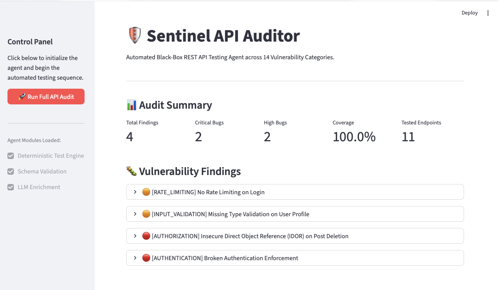

# 🛡️ Sentinel API Auditor (Hybrid Testing Agent)

An autonomous, black-box REST API testing agent built for rigorous backend evaluation. 

This agent utilizes a **Hybrid Architecture**: it strictly uses a deterministic Python state-machine to uncover vulnerabilities across 14 categories (ensuring 100% reproducible results and strict JSON schema compliance), and optionally utilizes an LLM layer (Google Gemini) to enrich the technical bug reports.

## ✨ Key Features
* **Deterministic Test Engine:** Mathematically tests for Rate Limiting, IDOR, Input Validation, Authentication, Mass Assignment, and more without relying on LLM hallucinations.
* **Strict Schema Compliance:** Uses `jsonschema` to validate the final output against `report.schema.json` before saving.
* **Interactive Dashboard:** Includes a Streamlit UI for real-time progress tracking and visual vulnerability reporting.
* **Graceful Degradation:** Capable of running 100% offline without AI if API keys are missing or revoked.

---

## 📁 Project Structure

```text
Backend_Testing_Agent/
├── main.py                # Core agent orchestrator (CLI entry point)
├── app.py                 # Streamlit interactive dashboard
├── config.py              # Environment variables and API setup
├── tests.py               # Deterministic test cases (The Fuzzer)
├── enricher.py            # Gemini LLM integration for report writing
├── reporter.py            # JSON schema validation and file compilation
├── requirements.txt       # Python dependencies
├── openapi.json           # Target API schema (Input)
└── report.schema.json     # Required report format (Validation)
```

## 🚀 Installation & Setup
1. Clone or download the repository
Ensure you are in the root directory (Backend_Testing_Agent/).

2. Install dependencies
This project requires Python 3.8+. Install the required packages:

       pip install -r requirements.txt

## 💻 How to Run the Agent
You can run the agent in two ways: via the visual dashboard (recommended) or via the command line.

### Option A: The Streamlit UI (Recommended)

To launch the interactive testing dashboard, run:

```Bash
streamlit run app.py
```
This will open a local web server (usually at http://localhost:8501). Click "Run Full API Audit" to watch the agent bootstrap, fire payloads, and visualize the generated report.json.


### Option B: Command Line Interface (CLI)

If you prefer a headless execution, run the main orchestrator directly:

```Bash
python main.py
```
The agent will output its progress to the terminal and generate report.json in the root directory.

## 🧠 Google Gemini API (Optional LLM Enrichment)
This agent uses the **gemini-2.5-flash** model strictly as a "Technical Writer" to take the raw, deterministic bugs found by the Python engine and rewrite the titles and descriptions into professional, enterprise-grade bug reports.

#### How to use Gemini:

1. Get a free API key from Google AI Studio.

2. Set the key as an environment variable in your terminal before running the script:

Mac/Linux:

```Bash
export GEMINI_API_KEY="your_api_key_here"
```
Windows (Command Prompt):

```Bash
set GEMINI_API_KEY=your_api_key_here
```
#### ⚠️ What if I don't use Gemini? (Graceful Degradation)

* The agent does not require Gemini to function. If you do not provide an API key, or if your API key is invalid/rate-limited, the system is designed to fail gracefully.

* The script will not crash.

* It will print a warning: **_[!] GEMINI_API_KEY not set. Running in purely deterministic mode._**

* The deterministic engine will still successfully attack the API, find the exact same vulnerabilities, and generate a perfectly valid report.json that strictly complies with the schema.

* The only difference is that the bug descriptions in the final report will contain raw, system-generated text (e.g., "Expected: 429 | Actual: 401") instead of long-form paragraphs.


# 👨‍💻 Author
# **Md Saib Hossain**
**AI Engineer • AI / ML / LLM & AI Safety Researcher**  
**Agentic AI Developer • Researcher in Autonomous & Multi-Agent Systems • Advanced Agentic AI Architect**

Designing safe, scalable, and human-centered intelligent systems for real-world healthcare and autonomous AI applications.

<p align="left">
  <a href="mailto:saibhossain5@gmail.com">
    
  </a>
  <a href="https://saibhossain.github.io/">
    
  </a>
  <a href="https://github.com/Saibhossain">
    
  </a>
  <a href="https://linkedin.com/in/saib-hossain-182834229">
    
  </a>
</p>